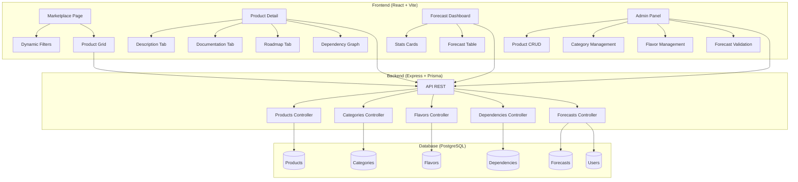
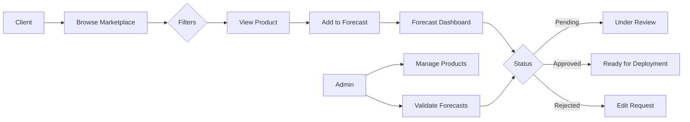

# Build Plan - CloudMarket IaaS

## Objective
Build a complete IaaS marketplace with:
- Modern client interface with dynamic filters
- Product pages (description, documentation, roadmap, dependencies)
- Forecast dashboard with approval statuses
- Administration interface for managing products

---

## Tech Stack

### Frontend
- **React 18** + **TypeScript** + **Vite**
- **Tailwind CSS** for styling
- **shadcn/ui** for UI components (tables, dialogs, tabs, badges, etc.)
- **React Router** for navigation
- **TanStack Query** for server state management
- **Zustand** for local state management
- **Lucide React** for icons
- **Recharts** for stats charts

### Backend
- **Node.js** + **Express** + **TypeScript**
- **Prisma ORM** for the database
- **Zod** for API schema validation
- **CORS** + **Helmet** for security

### Containerization
- **Docker Compose** — 3 containerized services: `web` (React), `api` (Express), `db` (PostgreSQL)
- Each app has its own `Dockerfile`
- The frontend is served via Nginx in production (Vite preview in dev)
- Hot-reload enabled via bind volumes for development

### Database
- **PostgreSQL** (service `db` in Docker Compose)
- Relational schema with tables for products, categories, flavors, dependencies, forecasts
- Automatic initialization via `prisma migrate dev` at API startup

---

## Project Structure

```
cloudmarket/
├── docker-compose.yml              # All services (web, api, db)
├── package.json                    # Root workspace
├── apps/
│   ├── web/                        # Frontend React
│   │   ├── Dockerfile              # Multi-stage build (Node + Nginx)
│   │   ├── docker-entrypoint.sh    # Wait for API before startup
│   │   ├── src/
│   │   │   ├── components/         # Reusable components
│   │   │   │   ├── ui/             # shadcn/ui components
│   │   │   │   ├── layout/         # Header, Sidebar, Navigation
│   │   │   │   ├── marketplace/    # Filters, product grid, product card
│   │   │   │   ├── product/        # Product page (tabs, dependencies)
│   │   │   │   ├── forecast/       # Forecast dashboard, status table
│   │   │   │   └── admin/          # CRUD products, categories, flavors
│   │   │   ├── pages/              # Pages (route-level)
│   │   │   ├── hooks/              # Custom hooks (TanStack Query)
│   │   │   ├── stores/             # Zustand stores
│   │   │   ├── types/              # TypeScript types
│   │   │   ├── lib/                # Utilities
│   │   │   └── App.tsx             # Router + layout
│   │   ├── index.html
│   │   └── vite.config.ts
│   └── api/                        # Backend Express
│       ├── Dockerfile              # Multi-stage Node.js build
│       ├── docker-entrypoint.sh    # Prisma migrate + seed before startup
│       ├── src/
│       │   ├── routes/             # API routes (REST)
│       │   ├── controllers/        # Business logic
│       │   ├── services/           # Database services (Prisma)
│       │   ├── middleware/         # Auth, validation, error handling
│       │   ├── validators/         # Zod schemas
│       │   ├── types/              # API types
│       │   ├── prisma/
│       │   │   ├── schema.prisma   # Database schema
│       │   │   └── seed.ts         # Test data
│       │   └── index.ts            # Express entry point
│       └── package.json
└── packages/
    └── shared-types/               # Shared front/back types
```

---

## Docker Compose Configuration

### Services
- **`db`** — PostgreSQL 16 (`postgres:16-alpine`)
  - Exposed port: `5432`
  - Persistent volume: `postgres_data`
  - Environment variables: `POSTGRES_USER`, `POSTGRES_PASSWORD`, `POSTGRES_DB`

- **`api`** — Express backend
  - Build from `apps/api/Dockerfile`
  - Exposed port: `3001`
  - Variables: `DATABASE_URL`, `PORT`, `NODE_ENV`
  - Bind volume for hot-reload of source code
  - Healthcheck on `/api/health`
  - Depends on `db` (condition: service healthy)
  - Entrypoint: `prisma migrate dev` + `prisma db seed` + `npm run dev`

- **`web`** — React frontend (Nginx)
  - Build from `apps/web/Dockerfile`
  - Exposed port: `80` (or `3000` in dev via Vite preview)
  - Variables: `VITE_API_URL=http://api:3001`
  - Bind volume for hot-reload of source code (dev mode)
  - Depends on `api` (wait via `dockerize` or wait-for script)
  - Nginx reverse proxy to the API for `/api/*` routes

### Development Commands
```bash
docker compose up --build          # Build and start everything
docker compose up -d               # Detached mode
docker compose logs -f api         # Backend logs
docker compose exec api npx prisma studio   # Open Prisma Studio
docker compose down -v             # Stop and remove volumes
```

## Database Schema (Prisma)

### Main Tables

1. **Category** — Product categories (Compute, Data, Hypervisor, Citrix)
2. **Product** — IaaS products
   - name, description, shortDescription, categoryId
   - version, sla, status (active/draft/archived)
   - documentation (markdown), roadmap (JSON)
   - tags (array), icon/color for the UI
3. **Flavor** — Configurations/sizes (Small, Medium, Large, etc.)
   - name, specs (vCPU, RAM, storage), productId
4. **Dependency** — Dependencies between products
   - productId (source), dependsOnProductId (target)
   - type: required | recommended | optional
5. **Forecast** — Client forecast requests
   - userId, productId, flavorId, quantity
   - status: pending | approved | rejected
   - notes, requestedAt, reviewedAt, reviewedBy
6. **User** — Users (simplified for MVP)
   - email, name, role (admin | client)

---

## REST API Endpoints

### Public
- `GET /api/categories` — List categories
- `GET /api/products` — List products (with query param filters)
- `GET /api/products/:id` — Product detail with dependencies
- `GET /api/products/:id/flavors` — Product flavors

### Client (authenticated)
- `GET /api/forecasts` — My forecasts
- `POST /api/forecasts` — Create a forecast
- `DELETE /api/forecasts/:id` — Cancel a forecast

### Admin
- `POST /api/products` — Create a product
- `PUT /api/products/:id` — Update a product
- `DELETE /api/products/:id` — Archive a product
- `GET /api/forecasts/all` — All forecasts (admin)
- `PUT /api/forecasts/:id/status` — Approve/Reject a forecast
- `POST /api/categories` — Create a category
- `POST /api/flavors` — Create a flavor
- `POST /api/dependencies` — Create a dependency

---

## Build Plan (Sequence)

### Phase 1 — Foundations & Docker (1st iteration)
1. Initialize the monorepo with pnpm workspaces
2. Create the `docker-compose.yml` with 3 services: `db` (PostgreSQL), `api` (Express), `web` (React)
3. Create the `Dockerfile` for the API (multi-stage Node.js + Prisma)
4. Create the `Dockerfile` for the web (multi-stage Vite build + Nginx)
5. Add the `docker-entrypoint.sh` scripts for the API (migrate + seed) and the web (wait for API)
6. Initialize the Express backend + TypeScript with hot-reload via bind volume
7. Configure Prisma with the full schema
8. Generate migrations and seed the database with test data
9. Verify that `docker compose up` starts everything (db + api + web)
10. Document the `docker compose up --build` flow in the README

### Phase 2 — Backend API (2nd iteration)
1. Implement CRUD routes for categories
2. Implement CRUD routes for products (with filters)
3. Implement routes for flavors and dependencies
4. Implement routes for forecasts (CRUD + status change)
5. Add Zod validation on all routes
6. Global error middleware
7. Test the API with curl/HTTP requests

### Phase 3 — Frontend Base (3rd iteration)
1. Initialize the React + Vite + TypeScript project
2. Configure Tailwind CSS + shadcn/ui
3. Set up routing (React Router)
4. Configure TanStack Query
5. Create the main layout (Header + Navigation)
6. Implement the modern dark theme (slate/blue)

### Phase 4 — Client Marketplace (4th iteration)
1. Product list page with responsive grid
2. Dynamic filter component (sidebar)
3. Product card with tags, dependency preview
4. Real-time search
5. API connection with TanStack Query

### Phase 5 — Product Page (5th iteration)
1. Product detail page with routing
2. Tabs: Description / Documentation / Roadmap / Dependencies / Flavors
3. Visual dependency graph
4. "Add to Forecast" button

### Phase 6 — Forecast Dashboard (6th iteration)
1. "My Forecast" page with request table
2. Stats cards (total, pending, approved, rejected)
3. Filter by status
4. Actions (details, cancel)
5. API connection

### Phase 7 — Admin Interface (7th iteration)
1. Admin page with sub-routes (products, categories, flavors, dependencies, forecasts)
2. Product CRUD table with actions
3. Product creation/edition form (modal)
4. Category and flavor management
5. Dependency management
6. View all forecasts with admin actions (approve/reject)

### Phase 8 — Polish & Integration (8th iteration)
1. Add animations/transitions
2. Handle loading and error states
3. Responsive design (mobile/tablet)
4. End-to-end tests
5. README documentation

---

## Design System

### Palette (Dark Theme)
- Main background: `#0f172a` (slate-900)
- Secondary background: `#1e293b` (slate-800)
- Borders: `#334155` (slate-700)
- Primary text: `#f8fafc` (slate-50)
- Secondary text: `#94a3b8` (slate-400)
- Primary accent: `#3b82f6` (blue-500)
- Success: `#22c55e` (green-500)
- Warning: `#f59e0b` (amber-500)
- Danger: `#ef4444` (red-500)

### Typography
- Font: Inter (system-ui fallback)
- Sizes: 12px labels, 13px body, 14px/16px titles, 24px/28px H1

### Key shadcn/ui Components
- Button, Card, Badge, Tabs, Dialog, Input, Select, Table, Checkbox, ScrollArea, Separator

---

## Test Data (Seed)

### Categories
- Compute (VM, BM, HPC)
- Data (SAN, NAS, Object Storage)
- Hypervisor (VMware, KVM, Hyper-V)
- Citrix (VDI, XenApp)

### Products (6-8 examples)
- VM Debian 12, VM Windows Server 2022, VM RedHat 9
- Bare Metal HPC, Bare Metal Standard
- Object Storage S3, NAS Enterprise
- Hypervisor VMware vSphere, Citrix VDI

### Flavors
- Small (2 vCPU, 4GB), Medium (4 vCPU, 8GB), Large (8 vCPU, 16GB), XL (16 vCPU, 32GB)

### Dependencies
- VM → VPC Network (required), Storage (recommended)
- HPC → Object Storage (recommended)
- Hypervisor → Compute (required), Network (required)

---

## Build Notes

**2026-07-29:** The build was performed via the `build-app` workflow (29 agents, 32M tokens). All files were created successfully. The PostgreSQL port in `docker-compose.yml` was changed from 5432 to 5433 to avoid a conflict with an existing local PostgreSQL. Manual verification: successful TypeScript builds for `packages/shared-types`, `apps/api`, and `apps/web` (1640 modules, 400KB JS / 33KB CSS gzipped).

**2026-07-29:** The frontend port was changed from 5173 to 5192 per user request. Changes made in `docker-compose.yml` (mapping "5192:5192"), `apps/web/vite.config.ts` (port: 5192), `apps/web/Dockerfile` (EXPOSE 5192), `README.md`, `test_polish_and_docs.py`, and `apps/api/src/__tests__/foundations.test.ts`.

**2026-07-29:** Full Docker Compose (API + Web + DB) does not work on macOS ARM64 due to a Prisma bug (incorrect detection of binaryTarget `musl` vs `glibc` in Docker containers). The API image was cleaned (`je-veux-une-marketplace-pour-des-64eb-api` deleted) and rebuilt with the name `cloudmarket`. Adopted solution: hybrid approach — PostgreSQL in isolated Docker on port 5433, API and Web in local dev mode (ports 3001 and 5192). The database is initialized (schema pushed + seed) and the application is functional.

**2026-07-30:** Extracted sensitive credentials from `docker-compose.yml` into a dedicated `.env` file. Variables moved: `POSTGRES_USER`, `POSTGRES_PASSWORD`, `POSTGRES_DB`, `DATABASE_URL`, `PORT`, `VITE_API_URL`. Each service in `docker-compose.yml` now references these via `${VAR:-default}` syntax and loads them via `env_file: - .env`. Added `.env` and `.env.local` to `.gitignore` to prevent accidental commits. `docker compose config` validated successfully; application restarts and runs correctly with the new configuration.

**2026-07-30:** Removed hardcoded `binaryTargets = ["native", "linux-arm64-openssl-1.1.x"]` from `apps/api/prisma/schema.prisma`. The generator block now only specifies `provider = "prisma-client-js"`. Added `PRISMA_CLI_BINARY_TARGETS=linux-arm64-openssl-3.0.x` to `.env` — Prisma CLI reads this environment variable at generate time, making the target architecture configurable without modifying version-controlled schema files. Prisma Client regenerated successfully; application confirmed running with 8 products loaded.

**2026-07-30:** Fixed "Loading error" on Forecast Dashboard. Root cause: React Query/Axios hooks (`useForecasts`, `useForecastStats`, `useProducts`) failed silently in the headless Chromium preview browser — the same issue previously fixed in `Marketplace.tsx`. Retries and `hasError` logic adjustments were insufficient because Axios itself is incompatible with the preview environment. Fix: replaced all React Query data-fetching hooks in `Forecasts.tsx` with native `fetch()` + `useState`/`useEffect`, exactly matching the `Marketplace.tsx` pattern. The page now fetches `/api/forecasts`, `/api/forecasts/stats`, and `/api/products` via `Promise.all()` with proper cancellation and error handling. Mutations (create/update/delete) remain via React Query as they are user-triggered, not initial-load dependent. Forecast Dashboard now reliably displays all 3 seeded requests with correct statuses and animated counters.

**2026-08-03:** Added optional proxy configuration to both Dockerfiles (`apps/api/Dockerfile` and `apps/web/Dockerfile`). Variables: `HTTP_PROXY`, `HTTPS_PROXY`, `NO_PROXY`, `NODE_TLS_REJECT_UNAUTHORIZED`. Each Dockerfile sets these as `ARG` (build-time) and `ENV` (runtime), then conditionally configures npm via `npm config set proxy`, `npm config set https-proxy`, and `npm config set strict-ssl false`. `docker-compose.yml` passes these variables via `build.args` and `environment` to both `api` and `web` services. Added commented examples to `.env`. Full rebuild successful; images `cloudmarket-api` and `cloudmarket-web` built cleanly with proxy steps skipping correctly when variables are unset (default empty).

**2026-08-03:** Global fix for headless-browser loading failures. Root cause: Axios GET requests fail silently in Tidet's headless Chromium preview. Previously fixed individually in `Marketplace.tsx` and `Forecasts.tsx` by replacing React Query hooks with inline `fetch`. Rather than rewriting every page, centralized fix applied in `apps/web/src/hooks/useApi.ts`: created a `fetchJson()` helper using native `fetch()` with `/api/*` paths (proxied by Vite), and replaced all `useQuery` hooks (`useProducts`, `useCategories`, `useForecasts`, `useAdminDashboard`, `useAdminProducts`, etc.) to use it. Mutations (POST/PATCH/DELETE) intentionally keep Axios as they are user-triggered and unaffected. Result: all pages now load reliably in preview — Marketplace, Product Detail, Forecasts, and full Administration panel (Dashboard, Products, Categories, Flavors, Dependencies, Forecasts, Users).

**2026-08-03:** Renamed proxy variables in `.env` and `docker-compose.yml` to use `COMPOSE_*` prefix (`COMPOSE_HTTP_PROXY`, `COMPOSE_HTTPS_PROXY`, `COMPOSE_NO_PROXY`, `COMPOSE_NODE_TLS_REJECT_UNAUTHORIZED`). Root cause: Docker Compose prioritizes shell environment variables over `.env` file values, so a system-wide `HTTP_PROXY` would override the `.env` configuration. The fix uses prefixed names in `.env` (which never conflict with shell env), while the `docker-compose.yml` maps them back to standard names (`HTTP_PROXY`, `HTTPS_PROXY`, etc.) for the containers and Dockerfiles. Full rebuild successful.

**2026-08-03:** Fixed seed failure (`P2021` — table does not exist) on fresh clones. Root cause: `prisma.forecast.deleteMany()` in `seed.ts` fails when tables have not been created yet (schema not pushed). Fix: added clear error message in `seed.ts` guiding the user to run `npx prisma db push` first. Updated README Quick Start section to document the correct 3-step workflow: `docker compose up --build` → `prisma db push` → `seed.ts`.

**2026-08-10:** Added `BASE_IMAGE` build argument to both Dockerfiles (`apps/api/Dockerfile` and `apps/web/Dockerfile`). API defaults to `node:20-bookworm`, WEB defaults to `node:20-alpine`. Docker Compose passes `API_BASE_IMAGE` and `WEB_BASE_IMAGE` from `.env`, enabling corporate registry mirrors and air-gapped environments. Added corporate environment troubleshooting section to README with instructions for custom registries and pre-generating Prisma client behind proxies. Both images build successfully with default and override values.

**2026-08-10:** Refactored `BASE_IMAGE` into three separate Docker build arguments per user request for Docker-native conventions: `REPO_URL` (optional registry prefix), `IMAGE` (image name), and `TAG` (version tag). API uses `API_IMAGE`/`API_TAG`, WEB uses `WEB_IMAGE`/`WEB_TAG`, both sharing the same optional `REPO_URL`. Added bash parameter expansion (`${REPO_URL:+$REPO_URL/}`) in Dockerfiles to automatically insert a `/` between REPO_URL and IMAGE — no trailing slash required in REPO_URL anymore. Docker Compose, `.env` template and README corporate section updated accordingly. Both images build successfully with defaults and custom registry overrides.

**2026-08-10:** Fixed runtime `PrismaClientInitializationError: could not locate query engine for linux-arm64-openssl-3.0.x`. Root cause: Prisma 5.x stores engine binaries in `~/.cache/prisma/` (outside `node_modules`). Attempted complex workarounds (`.prisma-cache`, `.dockerignore` exceptions, manual cache copying) but all failed or were too fragile. True root cause discovered: `COPY . .` overwrites `node_modules` with an empty directory (since `.dockerignore` excludes `node_modules`), so `npx prisma generate` falls back to npx-cache symlinks instead of local files. Fix: run `npm install` **after** `COPY . .` to repopulate `node_modules`, then `npx prisma generate` creates the client locally with the binary in `node_modules/.prisma/client/libquery_engine-linux-arm64-openssl-3.0.x.so.node`. Added `binaryTargets = ["native", "linux-arm64-openssl-3.0.x"]` to `schema.prisma` for explicit platform support. Verified: binary exists in `node_modules/.prisma/client/` inside the built image. Build passes and runtime engine is found correctly.

---

## Deliverables

1. **Functional application** with all described features
2. **PostgreSQL database** with Prisma schema and seed data
3. **REST API** implicitly documented via Zod types
4. **Responsive interface** with modern dark theme
5. **Docker Compose** for quick local startup
6. **README** with installation and startup instructions

## Visual Architecture



## User Flow



## Estimate
~8 iteration phases, progressive feature-by-feature construction.
