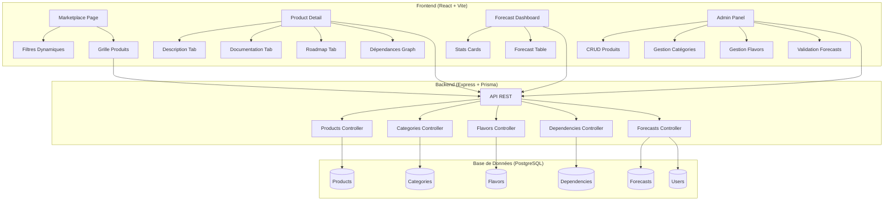
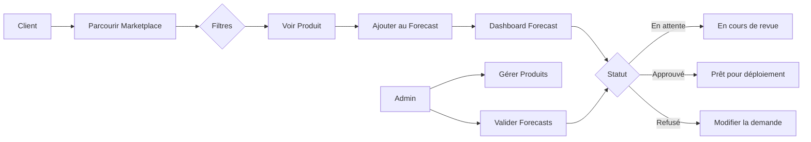

# Plan de Construction - CloudMarket IaaS

## Objectif
Construire une marketplace IaaS complète avec :
- Interface client moderne avec filtres dynamiques
- Fiches produits (description, documentation, roadmap, dépendances)
- Dashboard de forecast avec statuts d'approbation
- Interface d'administration pour gérer les produits

---

## Stack Technique

### Frontend
- **React 18** + **TypeScript** + **Vite**
- **Tailwind CSS** pour le styling
- **shadcn/ui** pour les composants UI (tables, dialogs, tabs, badges, etc.)
- **React Router** pour la navigation
- **TanStack Query** pour la gestion des données serveur
- **Zustand** pour le state management local
- **Lucide React** pour les icônes
- **Recharts** pour les graphiques de stats

### Backend
- **Node.js** + **Express** + **TypeScript**
- **Prisma ORM** pour la base de données
- **Zod** pour la validation des schémas API
- **CORS** + **Helmet** pour la sécurité

### Base de Données
- **PostgreSQL** (via Docker pour le développement)
- Schéma relationnel avec tables pour produits, catégories, flavors, dépendances, forecasts

---

## Structure du Projet

```
cloudmarket/
├── docker-compose.yml              # PostgreSQL + services
├── package.json                    # Root workspace
├── apps/
│   ├── web/                        # Frontend React
│   │   ├── src/
│   │   │   ├── components/         # Composants réutilisables
│   │   │   │   ├── ui/             # shadcn/ui components
│   │   │   │   ├── layout/         # Header, Sidebar, Navigation
│   │   │   │   ├── marketplace/    # Filtres, grille produits, carte produit
│   │   │   │   ├── product/        # Fiche produit (tabs, dépendances)
│   │   │   │   ├── forecast/       # Dashboard forecast, table statuts
│   │   │   │   └── admin/          # CRUD produits, catégories, flavors
│   │   │   ├── pages/              # Pages (route-level)
│   │   │   ├── hooks/              # Custom hooks ( TanStack Query)
│   │   │   ├── stores/             # Zustand stores
│   │   │   ├── types/              # Types TypeScript
│   │   │   ├── lib/                # Utilitaires
│   │   │   └── App.tsx             # Router + layout
│   │   ├── index.html
│   │   └── vite.config.ts
│   └── api/                        # Backend Express
│       ├── src/
│       │   ├── routes/             # API routes (REST)
│       │   ├── controllers/        # Business logic
│       │   ├── services/           # Database services (Prisma)
│       │   ├── middleware/         # Auth, validation, error handling
│       │   ├── validators/         # Zod schemas
│       │   ├── types/              # Types API
│       │   ├── prisma/
│       │   │   ├── schema.prisma   # Database schema
│       │   │   └── seed.ts         # Données de test
│       │   └── index.ts            # Entry point Express
│       └── package.json
└── packages/
    └── shared-types/               # Types partagés front/back
```

---

## Schéma Base de Données (Prisma)

### Tables principales

1. **Category** — Catégories de produits (Compute, Data, Hypervisor, Citrix)
2. **Product** — Produits IaaS
   - name, description, shortDescription, categoryId
   - version, sla, status (active/draft/archived)
   - documentation (markdown), roadmap (JSON)
   - tags (array), icon/color pour l'UI
3. **Flavor** — Configurations/tailles (Small, Medium, Large, etc.)
   - name, specs (vCPU, RAM, storage), productId
4. **Dependency** — Dépendances entre produits
   - productId (source), dependsOnProductId (cible)
   - type: required | recommended | optional
5. **Forecast** — Demandes de forecast par client
   - userId, productId, flavorId, quantity
   - status: pending | approved | rejected
   - notes, requestedAt, reviewedAt, reviewedBy
6. **User** — Utilisateurs (simplifié pour MVP)
   - email, name, role (admin | client)

---

## API REST Endpoints

### Public
- `GET /api/categories` — Liste des catégories
- `GET /api/products` — Liste des produits (avec filtres query params)
- `GET /api/products/:id` — Détail produit avec dépendances
- `GET /api/products/:id/flavors` — Flavors d'un produit

### Client (authentifié)
- `GET /api/forecasts` — Mes forecasts
- `POST /api/forecasts` — Créer un forecast
- `DELETE /api/forecasts/:id` — Annuler un forecast

### Admin
- `POST /api/products` — Créer un produit
- `PUT /api/products/:id` — Modifier un produit
- `DELETE /api/products/:id` — Archiver un produit
- `GET /api/forecasts/all` — Tous les forecasts (admin)
- `PUT /api/forecasts/:id/status` — Approuver/Rejeter un forecast
- `POST /api/categories` — Créer une catégorie
- `POST /api/flavors` — Créer un flavor
- `POST /api/dependencies` — Créer une dépendance

---

## Plan de Construction (Séquence)

### Phase 1 — Fondations (1ère itération)
1. Initialiser le monorepo avec pnpm workspaces
2. Configurer Docker Compose (PostgreSQL)
3. Initialiser le backend Express + TypeScript
4. Configurer Prisma avec le schéma complet
5. Générer les migrations et seed la base avec données de test
6. Vérifier que l'API démarre et se connecte à la DB

### Phase 2 — Backend API (2ème itération)
1. Implémenter les routes CRUD pour les catégories
2. Implémenter les routes CRUD pour les produits (avec filtres)
3. Implémenter les routes pour les flavors et dépendances
4. Implémenter les routes pour les forecasts (CRUD + changement de statut)
5. Ajouter la validation Zod sur toutes les routes
6. Middleware d'erreur global
7. Tester l'API avec des requêtes curl/HTTP

### Phase 3 — Frontend Base (3ème itération)
1. Initialiser le projet React + Vite + TypeScript
2. Configurer Tailwind CSS + shadcn/ui
3. Mettre en place le routing (React Router)
4. Configurer TanStack Query
5. Créer le layout principal (Header + Navigation)
6. Implémenter le thème dark moderne (slate/blue)

### Phase 4 — Marketplace Client (4ème itération)
1. Page liste produits avec grille responsive
2. Composant de filtres dynamiques (sidebar)
3. Carte produit avec tags, dépendances preview
4. Recherche en temps réel
5. Connexion API avec TanStack Query

### Phase 5 — Fiche Produit (5ème itération)
1. Page détail produit avec routing
2. Onglets : Description / Documentation / Roadmap / Dépendances / Flavors
3. Graphe visuel des dépendances
4. Bouton "Ajouter au Forecast"

### Phase 6 — Dashboard Forecast (6ème itération)
1. Page "Mon Forecast" avec tableau des demandes
2. Stats cards (total, en attente, approuvé, refusé)
3. Filtrage par statut
4. Actions (détails, annuler)
5. Connexion API

### Phase 7 — Interface Admin (7ème itération)
1. Page admin avec sous-routes (produits, catégories, flavors, dépendances, forecasts)
2. Table CRUD produits avec actions
3. Formulaire création/édition produit (modal)
4. Gestion des catégories et flavors
5. Gestion des dépendances
6. Vue tous les forecasts avec actions admin (approuver/rejeter)

### Phase 8 — Polish & Intégration (8ème itération)
1. Ajouter les animations/transitions
2. Gérer les états de chargement et erreurs
3. Responsive design (mobile/tablet)
4. Tests de bout en bout
5. Documentation README

---

## Design System

### Palette (Dark Theme)
- Background principal : `#0f172a` (slate-900)
- Background secondaire : `#1e293b` (slate-800)
- Bordures : `#334155` (slate-700)
- Texte principal : `#f8fafc` (slate-50)
- Texte secondaire : `#94a3b8` (slate-400)
- Accent primaire : `#3b82f6` (blue-500)
- Succès : `#22c55e` (green-500)
- Avertissement : `#f59e0b` (amber-500)
- Danger : `#ef4444` (red-500)

### Typographie
- Police : Inter (system-ui fallback)
- Tailles : 12px labels, 13px body, 14px/16px titres, 24px/28px H1

### Composants clés shadcn/ui
- Button, Card, Badge, Tabs, Dialog, Input, Select, Table, Checkbox, ScrollArea, Separator

---

## Données de Test (Seed)

### Catégories
- Compute (VM, BM, HPC)
- Data (SAN, NAS, Object Storage)
- Hypervisor (VMware, KVM, Hyper-V)
- Citrix (VDI, XenApp)

### Produits (6-8 exemples)
- VM Debian 12, VM Windows Server 2022, VM RedHat 9
- Bare Metal HPC, Bare Metal Standard
- Object Storage S3, NAS Enterprise
- Hypervisor VMware vSphere, Citrix VDI

### Flavors
- Small (2 vCPU, 4GB), Medium (4 vCPU, 8GB), Large (8 vCPU, 16GB), XL (16 vCPU, 32GB)

### Dépendances
- VM → Réseau VPC (required), Stockage (recommended)
- HPC → Object Storage (recommended)
- Hypervisor → Compute (required), Réseau (required)

---

## Livrables

1. **Application fonctionnelle** avec toutes les fonctionnalités décrites
2. **Base de données** PostgreSQL avec schéma Prisma et seed data
3. **API REST** documentée implicitement via les types Zod
4. **Interface responsive** avec thème dark moderne
5. **Docker Compose** pour le démarrage rapide en local
6. **README** avec instructions d'installation et démarrage

## Architecture Visuelle



## Flux Utilisateur



## Estimation
~8 phases d'itération, construction progressive feature par feature.
